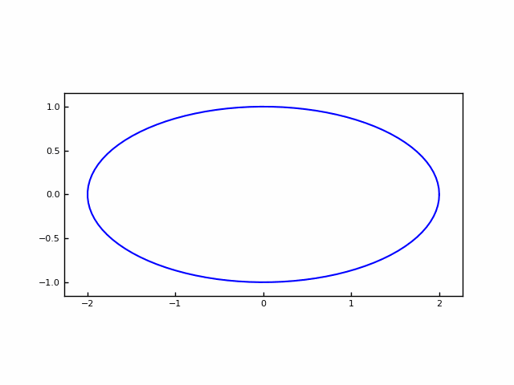
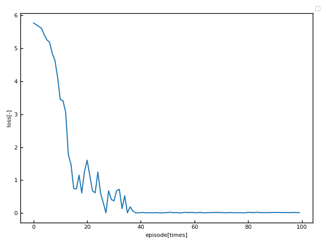
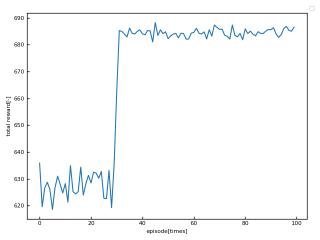
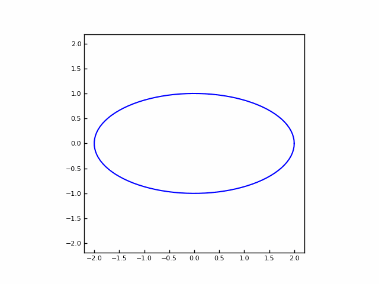
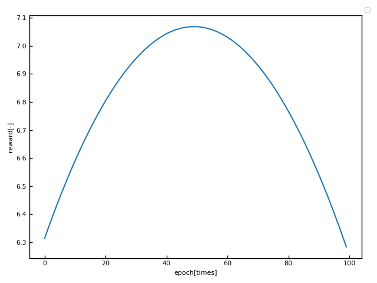
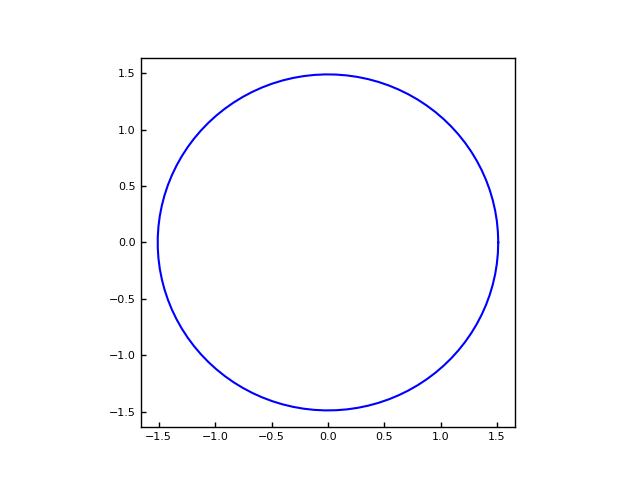

## 概要

等周問題に対する深層強化学習モデルの実装を試すことができます.

ここでは, 実装コードのダウンロード $\rightarrow$ 仮想環境の複製 $\rightarrow$ アルゴリズムの解説 $\rightarrow$ 実行 という流れで進めます.


**Deep Q-learning Network; DQN**では, **Convolutional Neural Network; CNN**を用いた画像の分類器と異なり, 学習データを必要としません.
DQNは設計者が設定した環境とインタラクティブに学習することで, 試行錯誤のみで正解を導きます.

今回取り扱う等周問題で前提とする定理は, 


**"長さが一定である閉曲線 $C$の中で, $C$が囲む面積が最大となるものは円である。"**


というものです.

DQNに与える環境は, 下記の楕円の式であり, $w$について ${+0.01, +0.00, -0.01}$を動かして, 最大面積となる形状を導出してもらいます.

$$
\frac{x^2}{w^2}+\frac{y^2}{h^2}=1 \tag{1}
$$


今回は, DQNを実際に実装し, アルゴリズムの主要なポイントを紹介します

## 学んだこと

- Anacondaを利用した仮想環境での開発
- Pytorchを利用した深層強化学習モデルの構築

## 始める前のスキルセット

- Pythonの基礎知識

## 実務活用例

- 自動運転技術
- 将棋や囲碁などのゲームAIの作成

## ツール

- Anaconda 22.9.0のデフォルトライブラリ

## データセット

下記のサイトから**Anaconda**をインストールします.

https://www.anaconda.com/products/distribution

-Vオプションでバージョンを確認します.

```cmd:cmd
conda -V
```

下記のように出力されたら既にインストールされています.

```cmd:output
conda 22.9.0
```

Anacondaのインストールの詳細は下記のサイトを参考にしてください.

次に, **github**から実装コードを取得します.
gitを既にインストールされている場合はcloneコマンドで取得できます.

```cmd:cmd
git clone https://github.com/yudaisugiyama/isoperimetric_problem.git
```

gitが入っていない場合は, 

https://github.com/yudaisugiyama/isoperimetric_problem から<>code $\rightarrow$ Download ZIPでダウンロードして解凍してください.

ダウンロードが完了したらenv.ymlから, 仮想環境の複製を行います.

cdコマンドでenv.ymlが存在するディレクトリに移動してください.

```cmd:cmd
cd dqn-isoperimetric-problem
```

移動したら下記のコマンドで仮想環境の複製を行います.

ここで, testは仮想環境の名前で任意の文字列です.

```cmd:cmd
conda env create -n test -f env.yml
```

createに成功したらツールの用意が完了しました.

## 仮想環境を有効化

まず, 先ほど複製した仮想環境を有効化します.

ここでも, testは仮想環境の名前であり, 複製した環境名と同じものを使ってください.

```cmd:cmd
conda activate test
```

## ディレクトリ構造
```
.
├── agent                       #  エージェント
│   ├── __pycache__
│   │   ├── model.cpython-38.pyc
│   │   ├── model.cpython-39.pyc
│   │   ├── policy.cpython-38.pyc
│   │   └── policy.cpython-39.pyc
│   ├── model.py    #  ネットワークやトレーニング方法の定義
│   └── policy.py   #  方策の定義
├── conf
│   └── config.yaml             #  パラメータ管理
├── const.py                    #  周長制約
├── env.yml                     #  仮想環境
├── outputs                     #  出力ファイル
│   └── 2022-11-14
│       ├── 15-55-47
│       │   ├── loss.png
│       │   ├── reward.png
│       │   ├── train.log
│       │   ├── warm_up.GIF
│       │   └── weight.pth
│       └── 16-03-59
│           ├── result.png
│           ├── reward.png
│           ├── test.GIF
│           └── test.log
│
├── README.md                   #  ドキュメンテーション
├── test.py                     #  テスト実行ファイル
├── train.py                    #  トレーニング実行ファイル
└── utils.py                    #  グラフ作成など
```

## モデルをトレーニング

冒頭でも触れたように, DQNは学習データを必要としません.

では, どうやって学習するのか?

DQNは**強化学習(Reinforcement Learning; RL)アルゴリズム**の中でも価値ベースのアルゴリズムに分類されます.

価値ベースのアルゴリズムとは方策
$\pi$
をfixし, 行動価値関数
$Q$
のみを学習によって改善します.

代表としては**Q-learning**や**SARSA**が挙げられます.

今回は, Q-learningを用いた実装をおこないます.

**Temporal Difference; TD誤差**に基づいて, 初期値0の行動価値関数の更新を下記のように定義します. 

$$
Q(s,a)\leftarrow Q(s,a)+\alpha(r+\gamma max_{a'}Q(s',a')-Q(s,a)) \tag{2}
$$

ここで, $s,a,r,a',\alpha,\gamma$はそれぞれ状態, 行動, 報酬, 次に採用する行動, 学習率(ステップ幅), 割引率を表しています.

**状態**はその時の形状であり, $(w,h)\in s$で表されます.

**行動**は, $w$について ${+0.01, +0.00, -0.01}$をおこなうものでしたね. どの行動を採用するかは**方策**
$\pi$
によって決定します.

**報酬**は, 行動に対する環境からのフィードバックとしてもらうものであり, 行動前後の形状の面積差分を与える. つまり, 面積が大きくなれば正の報酬, 小さくなってしまったらペナルティとして負の報酬が帰ってきます.

**学習率**は更新度合い, **割引率**は更新量の中でも, 将来の推定値を割り引くパラメーターです.

DQNは上記の式をニューラルネットワークでモデリングして, 考えます. 式(2)の右辺と左辺の二乗誤差を損失関数として, Adamで最小化します. 

$$
L(w)=(r+\gamma_{a'}Q(s',a';w)-Q(s,a;w))^2 \tag{3}
$$

Adamとは機械学習で最も多く用いられる最適化手法の1つです.

では実際にコードの中身を見てみましょう

方策のアルゴリズムは下記のような記述になっています.

```python:policy.py
import numpy as np
import torch

# トレーニング方策
class EpsilonGreedy:
    def __init__(self, model):
        self.model = model
        self.epsilon = self.model.epsilon

    def get_action(self, state, actions_list):
        # 任意で設定したepsilonの値未満の乱数が出た場合, True
        is_random_action = (np.random.uniform()<self.epsilon)
        # Trueの場合
        if is_random_action:
            q_values = None
            state = torch.tensor(state).unsqueeze(0).float()
            # 行動集合からランダムに決定
            action_ind = np.random.randint(len(actions_list))
        # Falseの場合
        else:
            state = torch.tensor(state).unsqueeze(0).float()
            q_values = self.model.net(state, nn_model='main')
            # 行動集合の中から最も行動価値が高い行動を採用
            action_ind = torch.argmax(q_values, axis=1).item()

        return action_ind

# テスト方策
class Greedy:
    def __init__(self, model):
        self.model = model
        self.epsilon = self.model.epsilon

    # 常に最も行動価値が高い行動を採用
    def get_action(self, state, actions_list):
        state = torch.tensor(state).unsqueeze(0).float()
        q_values = self.model.net(state, nn_model='main')
        action_ind = torch.argmax(q_values, axis=1).item()

        return action_ind
```


```python:model.py
# 行動から報酬をもらうまでの流れ
def step(self, state, actions_list, action_ind, total_reward, newton):
    action = actions_list[action_ind]
    next_state = [round(state[0]+action[0],self.round_digit), round(state[1],self.round_digit)]
    action[1] = newton.newton_method(state[0], state[1], action[0])
    next_state = [round(next_state[0],self.round_digit), round(action[1],self.round_digit)]
    next_area = self.calc_area(next_state)
    reward = next_area 
    total_reward += reward

    return next_state, action, reward, total_reward
```

```python:model.py
# 式(2)の左辺の計算
def calc_current_q_values(self, state, action):
    q_values = self.net(state, nn_model='main')[
        np.arange(self.batch_size), action
    ]

    return q_values
```

```python:model.py
# 式(2)の右辺の計算
def calc_td_error(self, reward, next_state):
    calculate = self.net(next_state, nn_model='main')
    get_greedy_action = torch.argmax(calculate, axis=1)
    max_q_values = self.net(next_state, nn_model='target')[
        np.arange(self.batch_size), get_greedy_action
    ]
    td_error = (reward + self.gamma * max_q_values).float()

    return td_error
```

```python:model.py
# 損失関数の計算
    def update_main_network(self, q_values, td_error):
        loss = self.loss_function(q_values, td_error)
        self.optimizer.zero_grad()
        loss.backward()
        self.optimizer.step()

        return loss.item()
```
ここで, 誤差関数の計算にはPytorchのtorch.nn.SmoothL1Loss()を使っています.

```python:model.py
self.loss_function = torch.nn.SmoothL1Loss()
```


上記のアルゴリズムを踏まえた上で, とりあえず動かしてみましょう

まずはトレーニングを行うtrain.pyを実行します.

*Linux, Macの場合はpython3コマンドを使用してください.

```cmd:cmd
python train.py
```

```cmd:output
[2022-11-14 17:36:58,509][utils][INFO] - total reward history
    total reward      loss
0     208.653274  3.507581
1     229.643826  3.035437
2     239.498059  2.719864
3     244.923276  2.548927
4     236.284524  3.044429
..           ...       ...
95    687.290309       NaN
96    685.052552       NaN
97           NaN       NaN
98    685.213402       NaN
99    684.730853       NaN

[100 rows x 2 columns]
[2022-11-14 17:36:58,524][utils][INFO] - weight path
C:\Users\dqn-isoperimetric-problem\outputs\2022-11-14\17-36-08/weight.pth
[2022-11-14 17:36:58,524][utils][INFO] - time
50.377s
```
トレーニングによって最適化された重みパラメータを記録しているファイルが生成され,
[xxxx-xx-xx xx:xx:xx,xxx][utils][INFO] - weight pathの下にそのファイルのパスが出力されるので, コピーしておきましょう. テスト時にパスを入力します.

上記の例では, ファイルのパスは,

C:\Users\dqn-isoperimetric-problem\outputs\2022-11-14\17-36-08/weight.pth

になります.

では, トレーニングの履歴のグラフで見てみましょう.

<p align="center">
    
    <br>  
fig.1 形状履歴
</p>
<br>

fig.1は学習初期の形状変更履歴を示しています. これはランダムに行動をして環境からのフィードバックをもらっている最中です.

<p align="center">
    
    <br>  
fig.2 損失関数の履歴
</p>
<br>

fig.2はトレーニング時の損失関数が0に収束して学習できていることを示しています.

episode60後半からは, 損失関数が0になってしまっていますが, 問題が簡単なためこの時点で最適解は求まっていました.

<p align="center">
    
    <br>  
fig.3 エピソードごとの報酬和履歴
</p>
<br>

fig.3はepisode60以降に急激に報酬が上がっていて, 学習が進んだことを示しています.

## 学習済データを使ってテスト

テストを行う場合はtest.pyを実行します.

```cmd:cmd
python test.py
```

下記のようなインタープリターが表示されたら

コピーしておいた重みファイルのパスを貼り付けます.

Enterを押して, テストを開始しましょう.

```cmd:cmd
Input path of weight.pth>
```

```cmd:cmd_example
Input path of weight.pth>C:\Users\\dqn-isoperimetric-problem\outputs\2022-11-14\17-36-08/weight.pth
```

報酬最大時の楕円の状態を最後に出力します.

ここでテスト時の履歴を見てみましょう.

<p align="center">
    
    <br>  
fig.4 形状履歴
</p>
<br>

fig.4は学習後の形状変更履歴を示しています. これは最も行動価値が高い行動のみを選択し, それが横幅を小さくする行動であることを示しています. 
この形状変更に対する報酬のグラフは以下のようになります.

<p align="center">
    
    <br>  
fig.5 報酬履歴
</p>
<br>

epoch50付近で上に凸の形のグラフになりました. 報酬は面積が大きくなるほど多くもらえるものでしたから, この履歴から最大報酬時の形状が円であれば最適化できているということになります.

報酬最大時の形状
$(w,h)$
は, 下記の値になりました.

```cmd:cmd
[1.51, 1.49]
```

<p align="center">
    
    <br>  
fig.6 最適形状
</p>
<br>

最適形状はfig.6に示すように, ほぼ円となりました. 完璧な円を求められない理由は, 行動の幅が0.01であることと, 周長の制約により, ぴったり
$w$
と
$h$
が同じになることがなかったためと考えます. 
